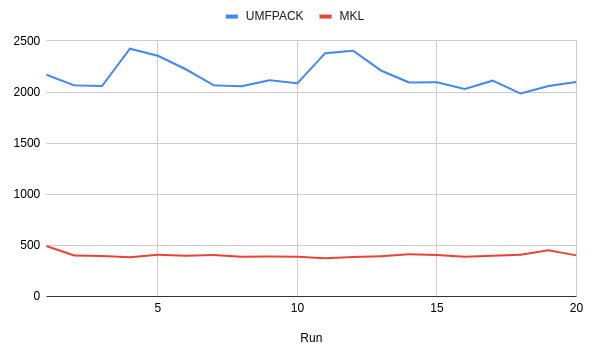

# olca-mkl

This is an experimental project that links the Intel Math Kernel (MKL) as calculation library for openLCA. The chart below shows a performance comparison with UMFPACK for fully solving `A * x = b` for an ecoinvent 3.9 matrix including JNI overhead for communicating between JVM and native memory:



## Building

The build scripts are written in Dart so that you need to have a current version of Dart (3.x) installed.

```bash
cd olca-mkl
dart build.dart
```

This will download the MKL Python package and its dependencies from pypi.org and extract the native libraries into the `bin` folder. It then compiles the bindings for the Java Native Interface (JNI) which are written in Rust against these libraries. (On Windows, it also generates a lib-file with the exported symbols for the linker first). This should then generate a `(lib)olcamkl.*` library in the `bin` folder.

The Java part has an `MKL` class with the native method-bindings and methods for loading the libraries from a folder. The method `MKL.loadFrom(DIR)` will load the libraries from the folder `{DIR}/olca-mkl-x64_v{VERSION}`. The current version is `1` (the next version would be `2`, then `3` etc.) and it is not the version of the MKL but the version of the openLCA JNI bindings for the MKL. The method `MKL.loadFromDefault()` will try to load the libraries from the openLCA default workspace `~/openLCA-data-1.4/olca-mkl-x64_v{VERSION}`. With the methods `MKL.isLibraryDir` and `MKL.isDefaultLibraryDir` you can also test if a directory contains the MKL library folder with the required libraries (useful for the integration in openLCA later).

**Note** that there is only support for `x64` CPUs, e.g.  on macOS M1/2, you need to run a `x64` JVM using the compatibility layer.

## TODO

* test performance on AMD processors (we added a method `mkl_serv_intel_cpu_true`, see https://danieldk.eu/mkl-amd-zen/)
* test if and how it works on macOS M1/M2 using the x64 compatibility layer
* move Java part to olca-core (`mkl` branch first) + tests
* port library download/packaging to the openLCA packager script (maybe with an `--mkl` flag)
* test in gdt-server containers
